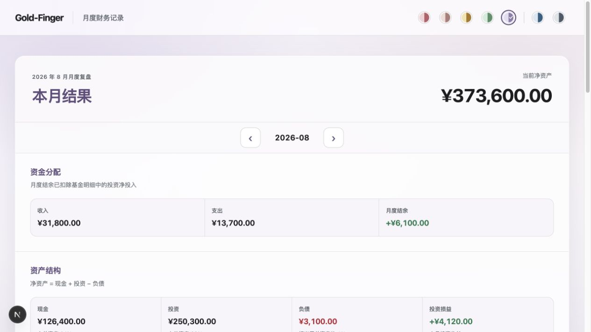
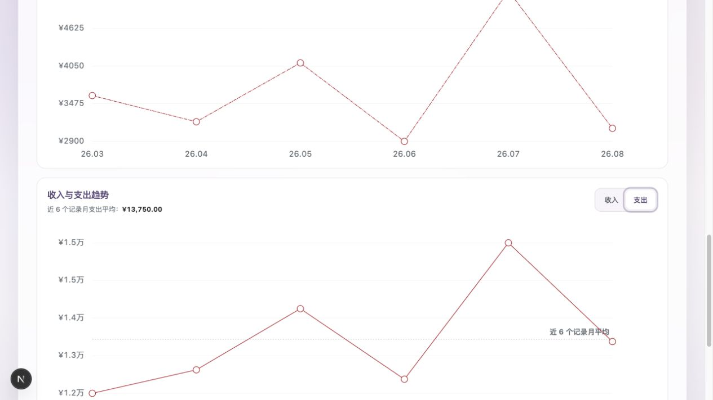
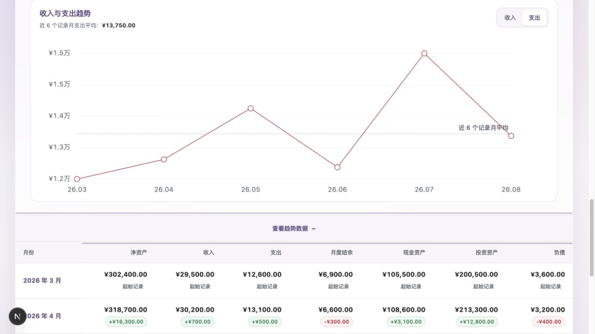

# Gold-Finger 深度体验测评报告

日期：2026-08-26  
审计方式：桌面端实际交互、空数据库首次使用、Demo 六个月历史数据、表单错误与保存闭环、代码与测试交叉核对  
目标用户任务：在 5–10 分钟内完成一次月末财务更新，并理解现金流、净资产与投资组合的变化

## 结论

Gold-Finger 已经是一个结构完整、视觉成熟的功能型 MVP，而不是原型。它把“低频月度快照”而非“逐笔记账”作为核心，定位准确；本月总览、历史趋势、投资分类下钻和精确数据表之间的层级也很合理。

但若把它当作长期记录真实财务数据的工具，目前仍有一个阻断级数据风险和数个高优先级闭环问题。最严重的是：新月份会复制上月每只基金的“净投入”，用户若没有逐项清零或改写，会把上月申购再次计入本月，直接扭曲月度结余。这类静默错误比界面瑕疵更危险。修复数据默认值、错误定位、保存后的结果回看，以及数据一致性提示后，产品才适合进入长期真实使用。

综合评分：**7.1 / 10**

| 维度               | 评分 | 判断                                         |
| ------------------ | ---: | -------------------------------------------- |
| 产品定位与范围控制 |  8.8 | 用户与频率定义清楚，功能克制                 |
| 核心复盘价值       |  7.8 | 能回答“现在有多少、钱如何流动、资产如何变化” |
| 月度录入效率       |  6.3 | 表单清晰，但入口、纠错和提交后路径拖慢闭环   |
| 数据可信度         |  5.2 | 新月净投入复用、缺乏跨月勾稽与异常提醒       |
| 信息与视觉设计     |  8.2 | 层级成熟、金额突出、桌面密度合适             |
| 可访问性基础       |  7.2 | 语义和标签较好，焦点管理仍需补齐             |
| 长期可运营性       |  5.8 | 历史跳转、备份恢复、单月删除与复盘备注不足   |

## 流程审计

### Step 1：首次进入空数据库 — 一般

空状态的语言友好，用户知道需要新建记录；但主操作不在首屏，顶部先出现一大块不可操作的“暂无结果”，用户必须继续向下寻找入口。对于首次使用，界面没有解释预计耗时、需要准备哪些数据，或第一份记录与以后月份有何区别。

### Step 2：展开首次建档表单 — 一般

四段式结构、编号、金额单位和基金可选添加都很清楚；收入、支出和日常现金支持加减算式，是贴合真实使用的小亮点。点击“新建数据”后，首个输入区只露出一部分，产品没有主动把焦点放到第一个字段。

### Step 3：进入新月份并继承基金 — 差

名称和分类从上一月继承是高效设计，市值留空也能迫使用户录入新快照；但“9 月净投入”同时继承了 8 月的 4500、3000、1500 等值。这是静默数据错误：金额看起来合理、字段又很多，极易被漏改，并直接改变月度结余。

### Step 4：提交错误数据 — 较差

字段级错误文案、`aria-invalid`、错误汇总和已填内容保留都做对了；但提交后视口停留在表单底部，只显示“请检查标出的输入项”，错误字段在数屏之外，且没有自动聚焦或跳转。对长基金列表尤其低效。

### Step 5：保存完成 — 较差

保存反馈明确，但表单保持展开，用户仍停留在底部；更新后的“本月结果”在页面顶部，保存成功后没有“查看结果”动作、自动折叠或回到总览。用户完成录入后最想看到的价值被放在数屏之外。默认全为 0 时也能一键创建记录，而产品没有单月删除能力，容易留下无意义月份。

### Step 6：查看本月总览 — 好

净资产是明确的视觉锚点，现金流、资产结构和投资损益的公式均有解释；金额格式统一，正负方向清晰。这一屏能快速回答核心问题，是当前产品最成熟的部分。

### Step 7：下钻投资组合 — 好

从资产大类到市场再到指数的路径可理解，面包屑和返回上一级减少迷失，交互也支持键盘。主要问题是顶层百分比经独立四舍五入后为 71% + 18% + 10% = 99%，会削弱财务产品的精确感。

### Step 8：分析历史趋势与明细 — 一般偏好

图表适合看走势，展开表适合核对精确值，两者互补；负债单独绘图也避免量级压缩。问题包括：纵轴万元格式会出现相邻刻度都显示“1.5 万”；表格把“支出增加”和“负债增加”也显示为绿色正向，把“负债下降”显示为红色负向，颜色表达与财务含义相反；历史入口只呈现围绕当前月份的六个月窗口，长期使用后缺少直接跳转到任意已记录月份的方式。

## 做得好的地方

1. **产品取舍准确。** 没有滑向逐笔记账、预算和自动建议，主流程始终围绕月度快照。
2. **核心口径有解释。** “净资产 = 现金 + 投资 − 负债”和“月度结余扣除投资净投入”降低误解。
3. **结果信息层级成熟。** 用户先看到净资产，再看现金流、资产结构和投资分布，符合复盘顺序。
4. **历史数据兼顾概览与精确值。** 图表、切换指标、可聚焦数据点和表格形成互补。
5. **表单工程质量扎实。** 标签、必填、金额精度、负数规则、服务端校验和输入保留均较完整。
6. **可访问性基础较好。** 页面有清楚的标题层级、区域、表格表头、控件标签、图表替代文本、焦点样式和键盘可聚焦的数据点。

## 按优先级排序的改进清单

### P0 — 发布真实财务使用前必须修复

1. **新月份的基金净投入必须重置为 0。** 只继承基金名称和分类；市值留空；本月净投入默认 0。增加单元测试和新月端到端验收，防止静默重复记账。

### P1 — 下一迭代优先完成

2. **建立“保存即看结果”的闭环。** 保存成功后自动收起表单并定位到本月结果；或在成功提示旁提供“查看本月结果”。同时保留“继续修改”的明确入口。
3. **修复长表单的错误定位。** 提交失败后聚焦第一个错误字段并滚动到可见位置；顶部或粘性区域给出可点击的错误摘要。基金行错误应指出“基金 N + 字段名”。
4. **把新建/更新动作前置。** 空月份在“暂无复盘结果”卡片内直接放主按钮；已有月份在总览标题区放“更新本月数据”。不要要求用户越过历史趋势才能开始本月任务。
5. **增加跨月一致性检查。** 至少提示：净资产变化、收入减支出、投资净投入、投资损益之间无法解释的差额；基金市值变化与“上月市值 + 本月净投入 + 本月损益”的差异也应可见。先做警告，不必阻止保存。
6. **按指标语义显示趋势颜色。** 收入、净资产、现金、投资、结余增加可为正向；支出和负债增加应为警示，下降应为正向。数字正负号仍表示数学方向，颜色表达业务含义。
7. **防止误建脏数据。** 当所有字段均为 0 且没有基金时，保存前二次确认或提示“这将创建一条全零记录”；同时支持删除单个月份并要求确认。
8. **补齐数据安全闭环。** 在界面中明确“数据仅保存在本机”，显示数据库/最近备份状态，并提供至少一种可恢复的导出或备份入口。长期个人财务数据不能只依赖 README 的手动文件操作。

### P2 — 提升长期使用价值

9. **增加月份选择器和“已有记录”索引。** 保留左右箭头处理相邻月份，同时允许直接选择年月，列出所有已记录月份并标记缺失月份。
10. **让投资占比总和稳定为 100%。** 使用最大余数法分配整数百分比，或展示一位小数并处理舍入差。
11. **改进图表刻度格式。** 根据数据范围自动选择精度，避免连续刻度显示相同的“1.5 万”；悬浮提示之外，可突出本月值、环比和极值。
12. **加入轻量复盘备注。** 每月允许记录 1–3 条“本月发生了什么 / 下月关注什么”，让历史趋势有上下文。保持纯文本即可，不扩展为财务建议。
13. **减少重复录入。** 新月份可选择性继承上月现金和负债作为待确认值，并对继承字段做明显标识；基金市值仍应要求确认，净投入必须为 0。

### P3 — 视觉与细节优化

14. **收纳主题选择。** 七个配色圆点在顶栏的权重高于核心任务，可合并为“外观”菜单，并显示当前主题名称。
15. **微调文案。** “2026 年 8 月月度复盘”可简化为“2026 年 8 月复盘”；“当前净资产”在历史月份应改为“该月净资产”，避免把历史快照误读为当前值。
16. **在投资下钻中同时显示金额。** 百分比之外增加市值，避免用户必须回到基金表才能理解实际规模。

## 建议实施顺序

第一批只解决数据正确性与闭环：P0-1、P1-2、P1-3、P1-4。  
第二批建立可信度：P1-5、P1-6、P1-7、P1-8。  
第三批优化长期留存：P2-9 至 P2-13。  
最后再处理主题、文案与展示精度等 P3 项。

## 可访问性与证据边界

本次确认了桌面端可见状态、DOM 语义、标签、键盘可聚焦控件、错误状态和实际交互。未使用屏幕阅读器逐项朗读，也未完成所有主题的自动对比度测量、200% 缩放、浏览器高对比模式或完整 WCAG 符合性测试，因此不能据此声称产品达到某一 WCAG 等级。手机端不在产品范围内，本次未作为缺陷审计。

## 验证记录

- 实际运行 Demo 六个月连续数据，并进入空数据库完成首次保存。
- 验证月份切换、投资分类下钻、资产/负债和收入/支出切换、趋势表展开、更新表单、错误提交与成功提交。
- 项目常规检查全部通过：Prettier、ESLint、TypeScript、Vitest；13 个测试文件、83 个测试通过。
